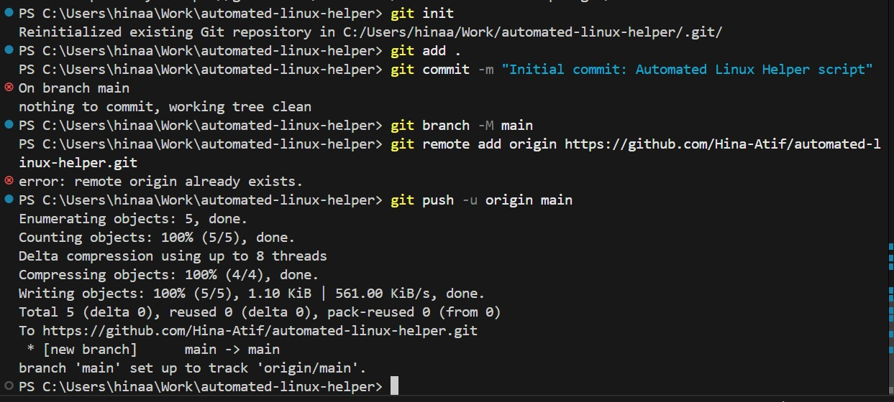
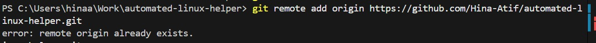
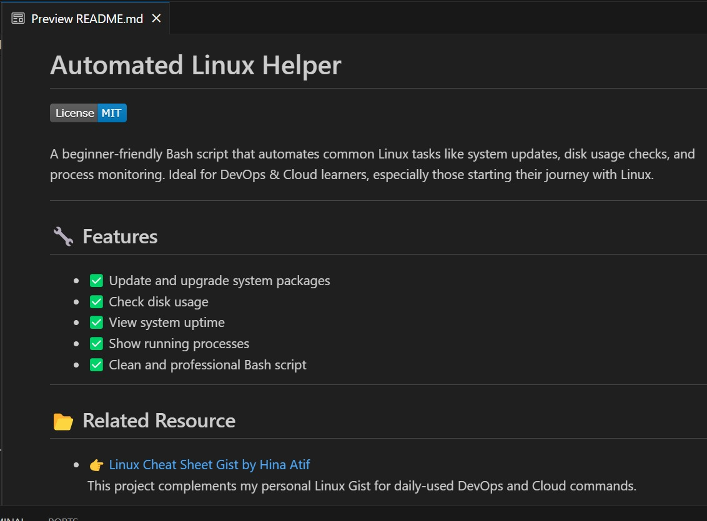

# 🐧 Automated Linux Helper - By Hina Atif


A beginner-friendly shell script that automates daily Linux commands used by Cloud and DevOps engineers.

---

## 📌 Features

✅ Menu-based Linux CLI  
✅ Automates daily commands:
- Show disk space (`df -h`)
- Memory usage (`free -h`)
- Process monitor (`top`)
- Create files and folders  
✅ Beginner-friendly terminal tool  

---

## 📸 Screenshots

### 1. Git Init  


### 2. Git Push  


### 3. README Preview in VSCode  


### 4. Linux Cheat Sheet Gist Linked  


---

## 🚀 How to Use

Run this on any Linux system, Git Bash, or EC2 instance:

```bash
git clone https://github.com/Hina-Atif/automated-linux-helper.git
cd automated-linux-helper
chmod +x linux-helper.sh   # Only on Linux
./linux-helper.sh

---

## 📘 Blog Post
Detailed project explanation on Medium:
🔗 https://medium.com/...


